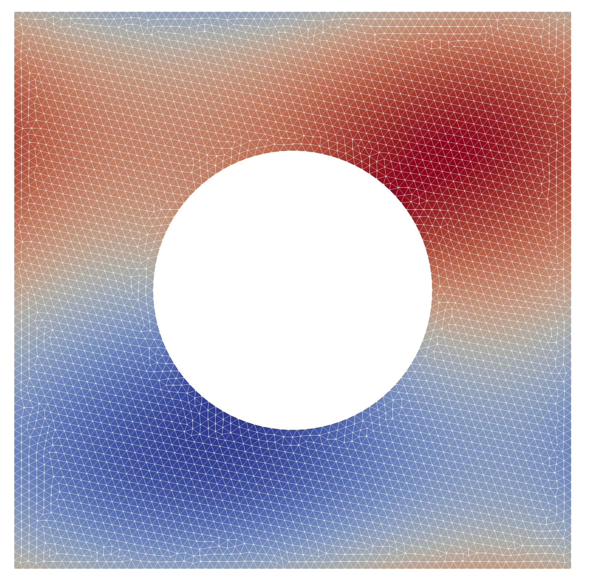

# Readme

Solve nonlocal reaction, diffusion, convection equation on periodic torus using zero mean constraint using `Gridap.jl`

$$
\begin{eqnarray}
-\Delta u + \boldsymbol{a} \cdot \nabla(u) + \mathcal{R} (u) = f \quad \textnormal{ in } \Omega \\\\\\
n_\Gamma \cdot \nabla(u) + u = g \quad \textnormal{ on } \Gamma \\\\\\
\int_\Gamma u \\;\textnormal{d}s = 0
\end{eqnarray}
$$

- $\Omega = {[0,1]}^2$ is periodic (torus)
- $\Omega$ has a hole in the middle with boundary $\Gamma$
- Linear nonlocal reaction is given by $\mathcal{R}(u)=\int_{\Gamma} u \\; \textnormal{d}s$



## Tutorial

- Install `julia`
- Install `gmsh` and have it in path

```bash
./create-mesh.sh  # optional if geo-file is changed or msh-file missing
julia --project solve.jl
# results.vtu can be opened with Paraview
```

## Info

- Mesh generated using `gmsh`

## TODO

- Implement zero mean, Lagrange multiplier style possible?
  - 'constraint=:zeromean' doesn't seem to work, strange..
  - https://gridap.github.io/Tutorials/dev/pages/t008_inc_navier_stokes/
- Implement Robin BCs
  - See https://github.com/gridap/Gridap.jl/issues/29
  - Code was removed from Gridap, try to find a working version
